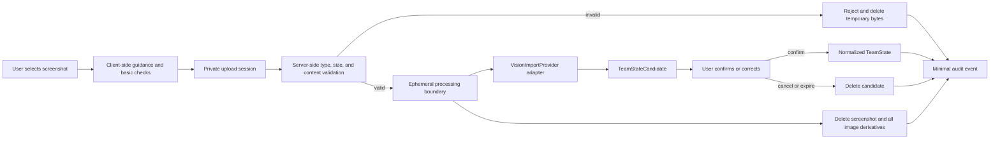

# Screenshot and Vision Import Privacy Requirements

Status: Pre-implementation privacy and retention baseline

Owner: FPL-57

Last updated: 2026-08-18

## 1. Purpose and boundary

This document defines the privacy, retention, security, and external-processing requirements for importing an FPL squad from a screenshot.

It is a product and engineering baseline, not legal advice. It does not select a vision model, storage vendor, hosting provider, jurisdiction, or lawful basis. Qualified privacy/legal review is required before public use.

The requirements apply equally to internal implementations and replaceable `VisionImportProvider` adapters. A provider is not approved merely because it is technically accessible.

## 2. Decisions

1. A screenshot is an ephemeral import artifact, never the durable team source of truth.
2. Screenshot processing exists only to create an editable `TeamStateCandidate`.
3. The user must confirm or correct the candidate before it becomes a durable normalized `TeamState`.
4. Manual team entry is a complete alternative and must not require a screenshot.
5. Raw screenshots, crops, thumbnails, OCR text, embeddings, and other image-derived artifacts follow the same short-lived retention boundary unless a narrower data classification is explicitly approved.
6. Raw screenshots must not enter application backups, analytics payloads, logs, support tickets, or model-training datasets.
7. External provider training, human review, or reuse is prohibited unless a separate explicit review changes this requirement.
8. External processing is disabled until provider terms, processing locations, subprocessors, retention, deletion, security, and reuse controls are reviewed and recorded.
9. The product must disclose the actual processing mode before upload and provide a manual fallback.
10. Unknown legal or provider implications block the affected processing path rather than being treated as acceptable.

These decisions implement data minimization, storage limitation, privacy by design/default, and defense-in-depth file handling as engineering requirements. They do not claim that these controls alone establish legal compliance.

## 3. Data categories

### 3.1 Raw screenshot and equivalent artifacts

This highest-sensitivity import category includes:

- original uploaded bytes;
- decoded image pixels;
- temporary crops, thumbnails, and normalized images;
- OCR output that reproduces visible screenshot text;
- image embeddings or feature vectors that could reveal or reconstruct screenshot content;
- provider-side request payloads containing the image;
- debug captures, failed-parser samples, and image-bearing traces; and
- cached or queued copies created during transport or processing.

All artifacts in this category inherit the raw screenshot deletion deadline. Renaming, cropping, encoding, hashing, or transforming the image does not automatically make it safe to retain.

### 3.2 `TeamStateCandidate`

An editable, provisional interpretation of the team. It may contain:

- player identities and squad positions;
- captain and vice-captain where visible;
- uncertain matches and extraction confidence;
- missing fields and validation errors;
- visible gameweek or team context needed for confirmation; and
- manually supplied bank, free transfers, chips, or prices.

The candidate is not confirmed truth. It remains limited to the onboarding session and has its own retention deadline.

### 3.3 Confirmed `TeamState`

The normalized state explicitly confirmed by the user. It contains only fields needed by supported product decisions and must not contain:

- screenshot bytes or links;
- OCR text;
- image coordinates or crops;
- the original filename;
- hidden image metadata;
- vision-provider payloads; or
- debug representations of the screenshot.

`TeamState` is durable product data with a lifecycle separate from the screenshot. Its broader account, inactivity, export, and deletion policy is owned by FPL-44 before public beta.

### 3.4 Audit metadata

Minimal metadata used to prove lifecycle completion may include:

- opaque import-session identifier;
- processing mode and adapter version;
- accepted/rejected file category and size band;
- created, confirmed, failed, canceled, expired, and deleted timestamps;
- deletion outcome and retry count;
- provider request identifier where required for deletion or incident investigation; and
- categorized error code.

It must not contain image content, OCR text, player names, team names, raw provider responses, original filenames, or free-form user content.

### 3.5 Operational logs and metrics

Operational records may contain aggregate counts, latency bands, failure categories, service health, and cost units. They must exclude:

- image bytes or encoded images;
- signed image URLs;
- OCR or extracted free text;
- player, manager, team, or league names from the screenshot;
- original filenames and local paths;
- complete provider request or response bodies; and
- tokens, cookies, capability URLs, or other access secrets.

## 4. Information that may appear in a screenshot

The product must assume that a screenshot can contain more than the intended squad. Possible content includes:

- display name, manager name, team name, rank, points, and mini-league information;
- squad selection, captaincy, transfers, prices, bank, chips, and strategic preferences;
- profile images or account identifiers;
- browser chrome, tabs, URLs, bookmarks, or device status information;
- notifications, message previews, email addresses, phone numbers, or other application overlays;
- filenames or image metadata such as creation time and, for non-screenshot images, location metadata;
- information about another person unintentionally captured on screen; and
- unexpected sensitive or confidential content unrelated to FPL.

The upload UI must tell users to crop the image to the squad area, check for notifications or unrelated personal information, and use manual entry if they do not want to upload an image.

The system must not attempt to identify the user, infer unrelated attributes, or extract content outside the defined squad-import purpose.

## 5. Purpose limitation

### Permitted purposes

- validate that the upload is a supported safe raster image;
- extract fields required to create a `TeamStateCandidate`;
- show uncertainty and support user correction;
- diagnose processing health using non-content metadata; and
- investigate a specific security incident under restricted access where a retained artifact still exists within its approved TTL.

### Prohibited purposes

- training or fine-tuning internal or external models;
- provider product improvement or human review;
- advertising, marketing, identity resolution, profiling, or cross-product enrichment;
- generic product analytics based on image or OCR content;
- creating a permanent screenshot library;
- retaining failed images as examples;
- sending screenshots to public malware-analysis or debugging services;
- support access to raw images after the import session; and
- reconstructing a deleted screenshot from derivatives.

A future proposal to use screenshots for any additional purpose requires a dedicated Linear issue, updated notice and retention analysis, provider review, and explicit approval before implementation.

## 6. Data flow

The `VisionImportProvider` may later be local or external. An external implementation adds a conditional processor boundary but does not change domain outputs or retention obligations.

## 7. Lifecycle requirements

### 7.1 Before upload

The user must see a concise just-in-time notice explaining:

- the screenshot is used to extract a candidate squad;
- what information may be visible and how to crop it;
- whether processing is local or external in the deployed configuration;
- whether data leaves the user's region, where known;
- that the screenshot is deleted under the stated short retention window;
- that the confirmed `TeamState`, not the screenshot, is retained;
- that the image is not used for model training or provider reuse;
- how to cancel and delete the import; and
- that manual entry is available without upload.

The user must take an affirmative upload action after seeing the notice. Whether a particular jurisdiction requires consent as the lawful basis is a question for qualified review; the product must not label an acknowledgement as legal consent without that review.

### 7.2 Upload accepted

- Create a high-entropy, short-lived import-session identifier.
- Do not use the original filename as a storage key.
- Bind access to the current import session using a non-public capability or an approved authenticated identity.
- Start the hard raw-image deletion TTL when the server accepts the first byte.
- Record only minimal audit metadata.

### 7.3 Validation and extraction

- Validate before passing content to an image decoder or vision provider where possible.
- Process only the normalized safe raster representation.
- Do not make the raw image publicly retrievable.
- Do not place image bytes, signed URLs, OCR output, or provider payloads in logs or traces.
- If extraction returns partial data, retain the candidate only; do not extend the raw-image TTL.
- A retry that requires the original image must occur within the same TTL. After expiry, require a new upload.

### 7.4 Confirmation

- User corrections override extracted values.
- Confirmation creates a normalized `TeamState` with no image-derived artifacts beyond approved normalized fields.
- Confirmation triggers immediate deletion of the raw screenshot and all image derivatives.
- The UI must not claim deletion is complete until the deletion workflow records success or clearly reports a pending failure.
- A failed deletion triggers operational alerting and retry; it must not silently extend retention.

### 7.5 Cancel or switch to manual entry

- Immediately invalidate upload access.
- Trigger deletion of the screenshot, derivatives, and unconfirmed candidate.
- Continue manual entry in a new or clean candidate context.
- Retain only the minimal deletion audit event.

### 7.6 Validation or extraction failure

- Delete rejected, malformed, or fatally failed content immediately after the error response is safely produced.
- Do not retain failed images for debugging.
- Offer retry with a new upload or complete manual entry.
- Error reports contain category codes and non-content diagnostics only.

### 7.7 Abandoned onboarding

- Raw screenshots expire under the one-hour hard TTL even if the browser closes without notice.
- Unconfirmed candidates expire after 24 hours of inactivity.
- Background lifecycle enforcement must not depend on the user returning to the product.
- Expiry jobs record deletion success without retaining content.

## 8. Retention schedule

| Data category | Default retention | Deletion triggers | Backup rule |
| --- | --- | --- | --- |
| Raw screenshot and image-equivalent derivatives under product control | Processing session only; hard maximum 1 hour from upload acceptance | confirmation, cancel, manual fallback, fatal failure, or TTL | prohibited from backups |
| Raw screenshot held by an approved external provider | zero-retention mode preferred; otherwise only the shortest documented transient window explicitly approved before use, never for training/reuse | request completion and provider deletion mechanism | provider backups/caches must be covered by review; unknown behavior blocks use |
| `TeamStateCandidate` | active onboarding session; maximum 24 hours after last activity | confirmation converts approved normalized fields; cancel or expiry deletes candidate | prohibited from long-term backups |
| Confirmed `TeamState` | retained independently for product use until deletion/replacement or the FPL-44 policy applies | user reset/delete, lifecycle policy, or account/research deletion | may be backed up only under the separately approved `TeamState` policy |
| Raw-content-free audit metadata | 30 days | scheduled lifecycle deletion; longer security retention requires separate approval | permitted only if content-free and access controlled |
| Operational logs | 14 days by default | rolling deletion; security incident hold requires documented approval | log backup must follow the same deadline |
| Aggregate research measures | under `VALIDATION.md` and approved research retention | end of approved research purpose | no raw screenshot or directly identifying content |

If an implementation cannot enforce these deadlines, screenshot import remains disabled. Product convenience is not a reason to extend raw-image retention.

## 9. Deletion semantics

Deletion must cover every controlled copy and derivative, including:

- temporary upload object;
- processing workspace;
- normalized or re-encoded raster;
- thumbnails and crops;
- OCR output and image embeddings;
- message-queue payloads and dead-letter queues;
- application, proxy, and tracing payload captures;
- CDN or content cache entries, which should not exist for this flow;
- provider request storage under the approved deletion mechanism; and
- developer or support artifacts.

### Required behavior

- Use idempotent deletion so retries are safe.
- Record a content-free deletion receipt with session ID, timestamp, target category, status, and retry count.
- Alert on missed raw-image TTL or provider deletion failure.
- Quarantine access during a failed deletion; do not continue ordinary processing.
- Define an operator escalation path before public use.
- Test deletion for confirmation, cancel, fatal failure, timeout, queue failure, and provider timeout.

Cryptographic erasure may support deletion where appropriate, but it does not replace removal of accessible copies or provider obligations without explicit security/privacy review.

## 10. Upload security requirements

The first supported upload contract is intentionally narrow:

- allow only JPEG, PNG, and non-animated WebP raster images;
- reject SVG, PDF, GIF, archives, documents, executables, and polyglot content;
- maximum encoded size: 10 MiB;
- maximum decoded size: 20 megapixels and 12,000 pixels on either axis;
- reject zero-dimension, truncated, malformed, multi-frame, or decompression-bomb-like input;
- validate extension, declared content type, file signature, and successful safe decode; no single check is sufficient;
- generate a random internal filename and ignore user-controlled paths;
- strip metadata and re-encode decoded pixels into a safe internal raster before vision processing;
- run parsing and image rewriting with resource limits and isolation;
- apply rate limits per import capability and broader abuse signals;
- protect state-changing upload operations from cross-site request forgery where the web architecture requires it;
- scan with a locally controlled or explicitly approved security mechanism; do not send files to a public scanning service; and
- keep image-processing libraries patched and covered by dependency/security review.

Client-side checks exist for usability only. Server-side validation remains authoritative.

These requirements follow OWASP's defense-in-depth recommendations to allowlist necessary types, distrust client content-type claims, validate signatures/content, randomize filenames, limit size, store outside the webroot, restrict access, and scan or safely rewrite content.

## 11. Storage and access-control requirements

- Store temporary content outside the public webroot in a private, non-listable processing boundary.
- Use encryption in transit and at rest for every temporary hop.
- Do not expose permanent or guessable object URLs.
- Use short-lived access scoped to one import session and one processing purpose.
- Apply least privilege: the upload validator, vision worker, and deletion worker receive only the access each requires.
- Prevent cross-session and cross-user access at every API and storage boundary.
- Do not grant ordinary support, analytics, or product-administration roles access to screenshot content.
- Emergency access requires a documented incident purpose, time-bound authorization, and audit event while the artifact remains inside its TTL.
- Do not use shared developer folders, email, chat, issue attachments, or local downloads for production screenshots.
- Ensure temporary objects are excluded from normal application backups and replicas intended for long-term recovery.
- A future authenticated product must bind imports to the approved user identity; an unauthenticated prototype must use a high-entropy session capability and must not rely on IP address as identity.

## 12. Processing modes

### 12.1 Local or on-device processing

Local processing may reduce external disclosure, but it is not automatically approved. Review must still cover:

- whether image bytes leave the device for any reason;
- model and library provenance;
- local caches, crash reports, and diagnostics;
- browser or operating-system storage behavior;
- extraction quality and user correction;
- model delivery and update integrity; and
- deletion of local temporary data.

### 12.2 Product-controlled server processing

Review must cover:

- upload and worker isolation;
- private temporary storage and hard TTL enforcement;
- access control and deletion verification;
- logging, tracing, crash dumps, and support tools;
- processing and backup regions;
- security incident response; and
- whether any underlying model service creates an additional processor boundary.

### 12.3 External vision-provider processing

External processing remains disabled until the approval gate in the next section is complete. The provider adapter must return normalized candidate fields and must not leak provider DTOs or storage semantics into the domain.

The deployed UI must reflect the real configured mode. It must not claim local processing when any image-equivalent artifact is sent externally.

## 13. External vision-provider approval gate

Before enabling any external provider, record and approve:

### Contract and purpose

- exact service and API product used;
- controller/processor roles as assessed by qualified review;
- data-processing agreement availability and terms;
- explicit restriction to the squad-extraction purpose;
- prohibition of provider training, product improvement, human review, sale, or unrelated reuse;
- commercial-use terms; and
- process for material terms changes.

### Retention and deletion

- request and response retention windows;
- zero-retention or equivalent configuration evidence;
- caches, abuse monitoring, logs, backups, and disaster-recovery copies;
- deletion API or contractual deletion behavior;
- deletion and backup-expiry service levels; and
- how failed or timed-out requests are handled.

### Location and subprocessors

- processing and storage regions;
- subprocessor list and notification process;
- international transfer analysis and mechanism where applicable;
- government/law-enforcement request policy where relevant; and
- ability to restrict regions or subprocessors.

### Security and operations

- encryption and access controls;
- independent security assurance and incident-notification terms;
- tenant isolation;
- support and human-access paths;
- rate limits, cost limits, and observability without content logging; and
- provider outage, fallback, and deletion-failure handling.

### Product transparency

- accurate pre-upload disclosure;
- manual fallback if the user declines upload;
- contact and rights-request path;
- provider name disclosure where required or chosen; and
- verified consistency between product claims and deployed configuration.

An unknown answer is recorded as `blocked`, not `assumed acceptable`. Provider selection is a future ADR and implementation decision, outside FPL-57.

## 14. User controls and transparency

The product must provide:

- manual team entry before and after any upload attempt;
- clear correction of every extracted field before confirmation;
- cancel/delete during onboarding;
- an explanation of what is retained after confirmation;
- a way to replace or delete confirmed `TeamState` under the broader product policy;
- a privacy contact or request route before public use;
- accessible notice language that does not hide provider processing in general terms; and
- an explicit distinction between extraction confidence and correctness confirmed by the user.

The product must not use dark patterns to make screenshot upload appear mandatory or to imply that declining external processing reduces access to the manual fallback.

## 15. Logging, observability, and support

### Allowed

- counts of accepted, rejected, completed, failed, canceled, and expired sessions;
- coarse file size and dimension bands;
- validation and extraction error codes;
- latency, token/operation counts, and provider cost units without content;
- deletion success, failure, and retry counts; and
- adapter, model, prompt, and rule versions where they do not contain user content.

### Prohibited

- screenshots or derivatives in logs, traces, session replay, or analytics;
- request/response body capture on upload and vision routes;
- full signed URLs or access credentials;
- extracted player/team text in generic telemetry;
- free-form support dumps containing candidate or image data; and
- automatic attachment of failed examples to monitoring or issue systems.

Support diagnostics should use synthetic fixtures and content-free session metadata. A user must not be asked to email or attach the original screenshot to a support ticket as the default troubleshooting path.

## 16. Threats and required mitigations

| Threat | Required mitigation |
| --- | --- |
| Accidental capture of unrelated personal information | pre-upload crop guidance, manual fallback, purpose-limited extraction, immediate raw deletion |
| Malicious or malformed file | narrow allowlist, signature and safe-decode validation, resource limits, isolated rewrite, patching, approved scanning |
| Public or cross-user image access | private storage, high-entropy scoped capability, authorization checks, no public URL/CDN |
| Raw content leaked through logs or tracing | body capture disabled, structured error codes, log tests, redaction as defense in depth |
| Provider training or reuse | contractual/configuration prohibition, approval evidence, provider disabled when unknown |
| Retention beyond promise | hard lifecycle TTL, deletion events, alerts, reconciliation job, backup exclusion |
| Queue or retry duplicates | opaque IDs, idempotent processing/deletion, content TTL independent of retry count |
| Insider or support access | least privilege, no routine content access, time-bound incident process, audit event |
| Model extracts wrong player | candidate status, uncertainty display, mandatory user confirmation, manual correction |
| Abandoned browser session | server-enforced TTL independent of client callbacks |
| Cost or denial-of-service abuse | size/dimension limits, rate limits, bounded processing, cost observability |
| Processor outage or deletion failure | fail closed, manual fallback, quarantine, retry and escalation, no unapproved fallback provider |

## 17. Security and privacy verification

Before screenshot import can be considered implementation-complete, verify:

- every lifecycle path deletes raw content within the required deadline;
- temporary content never enters backup, analytics, trace, or support systems;
- access from another session/user is rejected;
- expired and reused upload capabilities are rejected;
- MIME, extension, signature, malformed, oversized, high-dimension, animated, and polyglot test files are handled safely;
- metadata is stripped and safe raster rewriting occurs before vision processing;
- provider failure cannot route content to an unapproved fallback;
- deletion retry and alerting work when storage or provider deletion fails;
- candidate expiry and confirmation conversion remove unneeded fields;
- privacy notice matches the deployed processing mode; and
- synthetic fixtures, not user screenshots, are used in automated tests.

The security test plan and implementation belong to downstream issues. This document defines the required outcomes.

## 18. Public-use readiness gate

Before public beta or commercial use, qualified review must address:

1. intended launch jurisdictions and applicable privacy rules;
2. whether screenshot and candidate fields are personal data in the deployed context;
3. controller, processor, and subprocessor roles;
4. lawful basis, transparency wording, and whether consent is required for any optional purpose;
5. children/minors and age-related requirements;
6. international transfers and processing locations;
7. processor contracts, training/reuse restrictions, retention, and deletion;
8. whether a data-protection impact assessment is required or advisable;
9. user access, correction, deletion, objection, and complaint handling;
10. incident and breach response;
11. the relationship between this retention schedule and FPL-44; and
12. whether the screenshot may contain third-party or unexpected sensitive information requiring additional controls.

The decision and reviewer must be recorded. Engineering acceptance cannot substitute for this gate.

## 19. Open decisions and blockers

### Product and architecture

- Which screenshot layouts and fields are supported initially?
- Is the first acceptable implementation local/on-device, product-controlled server processing, external processing, or more than one mode?
- How is an import session bound to a user context before authentication is approved?
- Does `TeamState` persist only locally during the prototype or in server-side storage?
- What user-facing behavior occurs when deletion is pending or fails?
- Is JPEG/PNG/WebP sufficient, or is a justified additional format required later?

### Provider

- Which providers offer an enforceable zero-retention/no-training mode?
- What content is retained for abuse monitoring, logs, backups, or support?
- What are the processing regions and transfer mechanisms?
- Can provider-side deletion be verified or contractually assured?
- Are external model input and output excluded from human review and product improvement?

### Privacy and legal

- Which entity is responsible for the product and privacy contact?
- Which jurisdictions and age groups are in scope?
- What lawful basis and notices are appropriate?
- Is a DPIA required or advisable for the deployed processing?
- What `TeamState` retention and rights workflow will FPL-44 approve?
- What qualified reviewer signs off before public use?

Each unresolved provider or legal answer blocks only the affected screenshot-processing mode. Manual entry and unrelated prototype work may continue.

## 20. Downstream requirements

- FPL-58 must implement screenshot/manual import against this data boundary.
- FPL-33 and FPL-24 must show crop guidance, processing disclosure, manual fallback, uncertainty, deletion behavior, and error states.
- FPL-44 must incorporate the confirmed `TeamState`, research data, privacy notice, rights, and public-beta retention policy.
- FPL-23 must ensure agent and PR workflows do not place user screenshots in repository artifacts, logs, or issue attachments.
- A future vision-provider selection must be recorded as an ADR only after the approval gate is satisfied.

## 21. Reference baseline

These sources inform the requirements but do not replace project-specific legal or security review:

- [Regulation (EU) 2016/679 (GDPR), including Article 5 principles](https://eur-lex.europa.eu/legal-content/EN/TXT/?uri=CELEX:32016R0679)
- [EDPB Guidelines 4/2019 on Data Protection by Design and by Default](https://www.edpb.europa.eu/documents/guideline/guidelines-42019-on-article-25-data-protection-by-design-and-by-default_en)
- [EDPB overview of Data Protection Impact Assessments](https://www.edpb.europa.eu/topics/accountability-and-compliance-tools/data-protection-impact-assessment_en)
- [OWASP File Upload Cheat Sheet](https://cheatsheetseries.owasp.org/cheatsheets/File_Upload_Cheat_Sheet.html)
- [OWASP Input Validation Cheat Sheet](https://cheatsheetseries.owasp.org/cheatsheets/Input_Validation_Cheat_Sheet.html)
